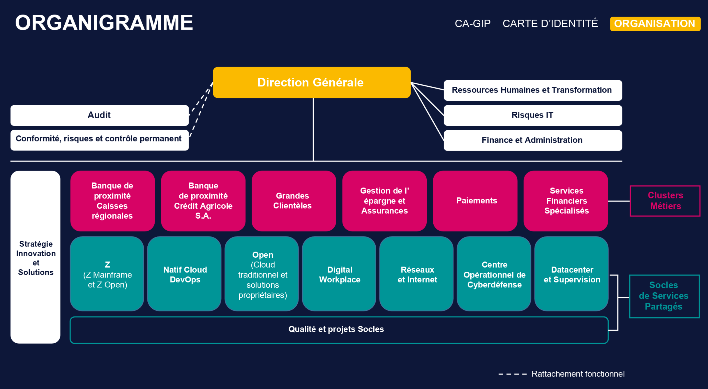
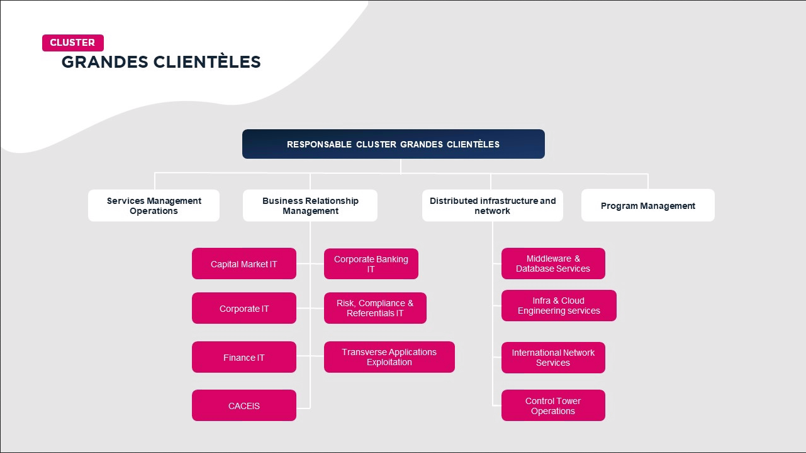

<!-- the content of latex-hide will be hidden from the pdf version. Indeed, latex can generate its own version of the summary.

Note: any balise name would work, I use "markdown-summary" for descriptiveness -->

<markdown-summary

# Table des matières

- [Table des matières](#table-des-matières)
- [Contexte du stage](#contexte-du-stage)
- [Orness](#orness)
- [DitRit](#ditrit)
  - [Participation à DitRit](#participation-à-ditrit)
  - [Projets de DitRit](#projets-de-ditrit)
- [Projet Lidy](#projet-lidy)
  - [Contexte de Lidy](#contexte-de-lidy)
    - [Origine de Lidy : Leto](#origine-de-lidy--leto)
    - [Analyser les fichiers OASIS TOSCA](#analyser-les-fichiers-oasis-tosca)
      - [ToP : TOSCA Parser](#top--tosca-parser)
      - [ANTLR](#antlr)
      - [Json Schema](#json-schema)
    - [Lidy](#lidy)
    - [Terminologie de Lidy](#terminologie-de-lidy)
    - [Développement initial de Lidy](#développement-initial-de-lidy)
    - [Reprise du travail sur Lidy](#reprise-du-travail-sur-lidy)
    - [YAML](#yaml)
    - [Aperçu de l'utilisation de Lidy](#aperçu-de-lutilisation-de-lidy)
    - [Aperçu du fonctionnement de Lidy-JS](#aperçu-du-fonctionnement-de-lidy-js)
  - [Recherche, travail et impression sur Golang](#recherche-travail-et-impression-sur-golang)
  - [Approches initiales, difficultés et exploration des stratégies](#approches-initiales-difficultés-et-exploration-des-stratégies)
  - [Changement du DSL Lidy et spécification](#changement-du-dsl-lidy-et-spécification)
    - [Détails sur la spécification du mot-clé `_mergeable`](#détails-sur-la-spécification-du-mot-clé-_mergeable)
  - [Tests de Lidy](#tests-de-lidy)
  - [Retour sur le travail de spécification](#retour-sur-le-travail-de-spécification)
    - [Retour sur les tests](#retour-sur-les-tests)
  - [Support des numéros de ligne lors de la conversion du YAML en Go](#support-des-numéros-de-ligne-lors-de-la-conversion-du-yaml-en-go)
  - [Conception de l'API de la librairie Lidy](#conception-de-lapi-de-la-librairie-lidy)
    - [Invocation de Lidy](#invocation-de-lidy)
    - [Fichiers dans Lidy](#fichiers-dans-lidy)
    - [Résultats de Lidy](#résultats-de-lidy)
  - [Conception interne de Lidy](#conception-interne-de-lidy)
  - [Analyse et validation du schéma](#analyse-et-validation-du-schéma)
    - [Deux problèmes de graphe](#deux-problèmes-de-graphe)
    - [Algorithme de parcours de graphe](#algorithme-de-parcours-de-graphe)
  - [Règles Lidy prédéfinies](#règles-lidy-prédéfinies)
  - [Rapporter les erreurs](#rapporter-les-erreurs)
    - [Enjeu d'exhaustivité du rapport des erreurs](#enjeu-dexhaustivité-du-rapport-des-erreurs)
    - [Enjeu d'informativité des erreurs](#enjeu-dinformativité-des-erreurs)
    - [Enjeu de légèreté de l'implémentation](#enjeu-de-légèreté-de-limplémentation)
- [Crédit Agricole](#crédit-agricole)
  - [Histoire du Crédit Agricole](#histoire-du-crédit-agricole)
  - [Quelques chiffres](#quelques-chiffres)
  - [Organisation CAGIP](#organisation-cagip)
  - [Espace des DBAs](#espace-des-dbas)
  - [Équipe](#équipe)
      - [Carte de prise en charge des sujets de l'équipe](#carte-de-prise-en-charge-des-sujets-de-léquipe)
- [WebDBA](#webdba)
  - [De PHP à Django et avenir](#de-php-à-django-et-avenir)
  - [Projet d'automatisation de la commande du Burst](#projet-dautomatisation-de-la-commande-du-burst)
    - [Qu'est que le "Burst" ?](#quest-que-le-burst-)
    - [Technologie ExaCC](#technologie-exacc)
    - [Processus d'ajout des CPUs](#processus-dajout-des-cpus)
    - [Attendre l'API Oracle](#attendre-lapi-oracle)
    - [Diagrame de séquence détaillé du burst](#diagrame-de-séquence-détaillé-du-burst)
      - [Client](#client)
      - [Requêtes invalides](#requêtes-invalides)
      - [Création des requêtes](#création-des-requêtes)
      - [Deburst](#deburst)
- [Glossaire](#glossaire)
- [Table des liens](#table-des-liens)
        - [benchemarksgame-team](#benchemarksgame-team)
        - [ca-histoire](#ca-histoire)
        - [ca-key-figures](#ca-key-figures)
        - [go-yaml](#go-yaml)
        - [go-yaml-issue-108](#go-yaml-issue-108)
        - [go-yaml-issue-108-mc](#go-yaml-issue-108-mc)
        - [investopedia-top-banks](#investopedia-top-banks)
        - [JSON-Schema-draft-07](#json-schema-draft-07)
        - [learn-yaml-inyminutes](#learn-yaml-inyminutes)
        - [lib-yaml](#lib-yaml)
        - [lidy-documentation](#lidy-documentation)
        - [lidy-predefined-rules](#lidy-predefined-rules)
        - [lidy-short-reference](#lidy-short-reference)
        - [orness-valeurs](#orness-valeurs)
        - [orness-histoire](#orness-histoire)
        - [orness-societe](#orness-societe)
        - [orness-engagements](#orness-engagements)
        - [tiobe](#tiobe)
        - [top](#top)
        - [yaml](#yaml-1)
        - [yaml-json-schema](#yaml-json-schema)
        - [yaml-recommended-schema](#yaml-recommended-schema)
        - [yaml-timestamp](#yaml-timestamp)

/>

<!-- cSpell:enable -->

_Les liens de la table des matières sont cliquables. **Il est possible de revenir en arrière après avoir cliqué sur un lien en utilisant le raccourci clavier Contrôl+[flèche gauche]**. Contrôle+[flèche droite] permet de retourner en avant. Ces raccourcis peuvent ne pas être présent dans tous les visionneurs de document PDF, mais ils sont présents dans ceux des navigateurs web, ainsi que dans le visionneur Sumatra PDF._

_Ce rapport est disponible au format PDF, [Markdown-source](https://raw.githubusercontent.com/mathieucaroff/rapport3A/master/README.md) et [Markdown-HTML](https://github.com/mathieucaroff/rapport3A), quoique la version HTML puisse contenir des artéfacts dus aux différences d'interprétation du Markdown entre le convertisseur PDF et le convertisseur HTML._

\clearpage

# Contexte du stage

Compte tenu du contexte de la pandémie, le stage ne s'est pas déroulé dans les conditions initialement prévues. La date de début du stage, programmé pour débuter le 2 avril, s'est progressivement décalée au 2 juin, date d'embauche par l'entreprise Orness.
Le stage devait être réalisé au profit du Crédit Agricole (CA). Or, en raison de difficultés à formaliser le contrat entre Orness et le CA dans ce contexte particulier, il s'est finalement déroulé en deux temps.
  - La première période a été réalisée au bénéfice de l'association DitRit, sponsorisée par Orness. Le projet portait sur la librairie de validation de données Lidy. Cette première mission s'est déroulée en distanciel avec pour difficulté, l'incertitude sur sa durée car la date de début au CA était indéterminée. Le périmètre de cette première tâche était donc susceptible d'être modifié en fonction du temps restant disponible.
  - La seconde période a débuté fin juillet et s'est déroulée au Crédit Agricole, localisé à Guyancourt. Le projet portait cette fois majoritairement sur l'outil d'inventaire WebDBA. Le stage s'est déroulé essentiellement sur site, au sein d'une équipe, jusqu'au second confinement où le travail en distanciel était de rigueur.

# Orness

Orness est une entreprise de services du numérique (ESN), située à Paris, avec ses bureaux dans le 9ème arrondissement. Cette SARL a été fondée en 2001 par Ghada AJAKA et Carole AMADO qui coprésident l'entreprise, appuyées par Xavier TALON et Herve CHIBOIS, les deux codirecteurs techniques, eux aussi membres fondateurs. [(orness-histoire)](#orness-histoire)

Elle compte aujourd'hui plus d'une centaine d'employés cadres. Avec un chiffre d'affaires de 12 millions d'euros, elle affiche un résultat de 650 mille euros. [(orness-societe)](#orness-societe)

<!-- ## Culture d'entreprise -->

Orness accorde une grande importance à l'humain. La qualité de la vie des employés au travail, l'entente et le sentiment de sécurité morale ont une grande importance chez les dirigeants de Orness. Leur maniement de ces valeurs, dans une entreprise à taille humaine, permet de créer une atmosphère relaxante chez Orness. Ainsi, les valeurs de transparence, d'audace et de partage se ressentent bien, tant chez les dirigeants qu'au sein des employés. [(orness-valeurs)](#orness-valeurs)

Outre l'importance accordée au bien-être au travail, Orness s'engage sur les sujets de l'Open Source, de la souveraineté numérique et de l'inclusion des femmes dans le milieu professionnel, notamment au travers de partenariats. [(orness-engagements)](#orness-engagements)

<!-- ## Activité -->

<!-- TODO -->

<!-- ## Expertise -->

# DitRit

DitRit est une association à but non-lucratif réalisant un travail de réflexion et de mise en pratique sur les sujets relatifs à la transition numérique. DitRit s'intéresse en particulier à cette transition pour les grandes entreprises. Les membres fondateurs de DitRit la définissent aussi comme un _Think and Do Tank_ de la transition numérique.

Les activités de l'association prennent donc deux formes : celle de réflexion et celle de création logiciel. Le travail de recherche, d'analyse et de synthèse est mené par des _groupes de réflexion_. Ce travail peu parfois donner lieu à des réalisations plus concrètes sous forme de projets de logiciel Open-Source, librement accessibles en tant que repository Github de l'association.

Les groupes de réflexion se tiennent régulièrement, avec une période de l'ordre quelques semaines. Ils traitent des sujets tels que la sécurité informatique en entreprise, l'application des bonnes pratique ITIL et aussi l'encadrement des activités et process de l'association. Par ailleurs, les avancées réalisées sur l'ensemble des projets et sujets de l'association sont rapportés lors d'une réunion hebdomadaire ouverte au publique, tenu entre midi et une heure.

Ditrit utilise Zulipchat ainsi que les mails pour la communication écrite entre ses membres, Jitsi pour la communication orale et vidéo, Nextcloud pour le partage de fichiers et Github pour l'hébergement du code source. Le langage de programmation principalement utilisés était initialement Java, mais depuis 2019 DitRit réalise la plupart de ses développements en Golang.

## Participation à DitRit

La plupart des individus ayant apporté une contribution à DitRit sont inscrits dans l'instance Zulipchat de l'association. En novembre 2020, celle-ci compte 30 noms. Je vais donc me contenter de présenter les plus notables :

- Jan Atac
- Joseph Priou
- Romain Fairant
- Thierry Cagnin
- Xavier Talon
- Cédric Vautrain
- Hervé Chibois

Jan, Joseph, Romain, Thierry et Xavier sont les cinq membres fondateurs de l'association. Joseph, Xavier et Romain assurent la tenue des réunions hebdomadaires. Xavier et Hervé sont les deux directeurs techniques de Orness. Ils réalisent respectivement le suivi des travaux de développement de Romain et Cédric sur les projets Gandalf et Ogree-3D. Romain et Cédric sont deux développeurs employés par Orness à temps plein pour travailler sur les projets de DitRit.

Ma présence et mon travail au sein de DitRit m'ont donné l'occasion de discuter avec Joseph, Romain et Xavier.

## Projets de DitRit

Gandalf est un projet de système d'interconnexion automatique visant à rendre facile l'intégration et l'interopérabilité des différentes applications désirables pour disposer d'une usine logicielle. Gandalf intègre dans sa conception l'ensemble des contraintes spécifiques aux très grandes entreprises, telles que la haute disponibilité ou encore le support de clients multiples (DMZ).

Ogree est un projet développé par Hervé afin d'analyser les logs produits par des salles de machines et d'en extraire des informations afin de reconstituer la carte du réseau ainsi que d'autres vues synthétiques. En effet, Hervé agit en tant que consultant et intervient physiquement dans les salles de machines lorsqu'une telle intervention est nécessaire. Le projet Ogree est donc né de ce besoin de disposer de données à jour lors de ses interventions.

Le projet Ogree-3D dérive du projet Ogree. Il a pour but de construire des vues tridimensionnelles des salles de machines, afin de faciliter la préparation d'interventions, ainsi que de manière générale, de faciliter la maintenance de l'infrastructure informatique physique. Ce projet est développé en C# par Cédric à temps plein depuis juillet 2020, avec le moteur de rendu de Unity.

Enfin, DitRit comporte aussi des projets de moindre envergure. Il s'agit de Shoset, librairie de gestion de socket et de routage pour les systèmes redondants, ainsi que de Lidy, une librairie d'analyse et vérification de données structurées qui conserve le lien aux sources. Shoset a été construit pour répondre à un besoin du projet Gandalf, projet présenté plus haut, tandis que Lidy, lui répond à un besoin de Leto, un autre projet qui sera présenté dans la section Lidy.

Durant la période pendant laquelle j'ai été affecté à travailler pour DitRit, mes contributions se sont principalement axées sur le projet Lidy. J'ai aussi travaillé à l'automatisation du déploiement du site web de DitRit.

# Projet Lidy

_Période juin-juillet : Projet Lidy_

Lidy est une librairie qui permet à un développeur de lire et d'analyser un fichier YAML, afin de valider qu'il correspond bien à un format complexe décrit par le développeur.

## Contexte de Lidy

### Origine de Lidy : Leto

Le projet Lidy a émergé comme un outil nécessaire au développement d'un projet plus ambitieux : Leto. Leto est un projet d'orchestrateur de système multi-machines et cloud visant à implémenter le standard TOSCA, standard produit par le groupe OASIS. Le standard TOSCA étant au format YAML, le projet Leto s'est rapidement retrouvé dans le besoin de pouvoir analyser un fichier YAML afin de déterminer s'il s'agis d'un fichier TOSCA valide ou non. Comme nous allons le voir, ce besoin s'est trouvé difficile à satisfaire et a ultimement mené à la naissance du projet Lidy.

### Analyser les fichiers OASIS TOSCA

#### ToP : TOSCA Parser

Le [projet ToP](#top), produit par l'association DitRit, vise à produire un parseur dédié à la syntaxe TOSCA. Il utilise ANTLR pour les versions de TOSCA inférieures à la version 2.0. À partir de la version 2.0, ANTLR s'est révélé limité pour parser les blocs indenté de YAML, ce qui a mené à l'adoption d'un outil de parsing YAML dédié. À ma connaissance, ce projet n'a pas abouti. Il ne répond pas entièrement aux besoins de Leto et a donc été progressivement abandonné, remplacé par Lidy.

#### ANTLR

La première approche utilisée pour analyser les fichiers YAML TOSCA, a été l'utilisation d'un outil d'analyse générique Java : ANTLR. En effet, fin 2018 - début 2019, l'association DitRit utilisait principalement le langage de programmation Java. ANTLR, "ANother Tool for Language Recognition" est un parseur pour les langages non-contextuels (_context-free_). C'est un parseur LL(\*), donc un parseur top-down, ce qui signifie qu'il cherche à attribuer une valeur unique à chaque mot qu'il lit, aussitôt que possible.

Dans le cas de Leto, ANTLR a été capable de produire des parseurs pour les versions 1.0, 1.1 et 1.2 de TOSCA. En effet, ces versions sont basées sur XML, un langage que ANTLR parvient à _parser_. Cependant, les versions ultérieurs à la version 1.2 de TOSCA sont basées sur YAML. ANTLR n'est pas capable de produire de parseur YAML, ni TOSCA 2.0+, car dans ces langages, le niveau d'indentation a valeur de délimiteur de blocs. Cette approche de la délimitation des blocs est très difficile à prendre en compte sans une fonctionnalité dédiée et il s'est trouvé que ANTLR ne dispose pas d'une telle fonctionnalité. Il est toujours possible de prendre en compte l'indentation avec ANTLR, mais ceci utilise une astuce qui complique fortement la grammaire, et donc qui ruine la vitesse d'exécution de l'analyse. Ces deux facteurs ont mené à l'abandon de ANTLR pour le parsing des fichiers TOSCA 2.0+.

#### Json Schema

La seconde approche pour l'analyse syntaxique TOSCA 2.0+ a été l'utilisation d'un parseur générique de données YAML, couplé à un système de vérification de données. Le système de vérification de données utilisé était AJV, un outil JS (JavaScript) qui implémente la spécification JSON Schema.

AJV, "Another JSON Validator", descend de DJV, "Dynamic JSON Validator". Ensemble, ils constituent les deux implémentations JS les plus rapides de la spécification JSON-Schema-draft-07, devant json-schema-validator-generator et jsen. Ces outils fonctionnent ainsi : un développeur souhaite valider les données qu'il reçoit d'un utilisateur. Il décrit le format de ces données dans un fichier JSON qui respecte la spécification JSON-Schema. Ensuite, il écrit du code qui charge le JSON-Schema dans AJV et en retire un "schéma compilé", qu'il peut alors utiliser pour valider des données structurées reçues de l'utilisateur. Lorsqu'une donnée de l'utilisateur ne respecte pas le schéma, l'ensemble des divergences entre la donnée fourni et le format de donnée attendu est rapporté. Le code du développeur peut ensuite décider que faire de cette liste d'erreurs. Dans la plupart des cas, il s'agit de signaler ces erreurs à l'utilisateur.

AJV et JSON Schema répondaient bien au besoin de ToP, cependant deux problèmes se dégageaient de leur utilisation :

- AJV n'opère que sur les données après dé-sérialisation. Ceci implique que AJV ne peut **connaître les numéros de ligne** d'où proviennent les données. Ainsi, il n'est pas possible de signaler à l'utilisateur la position des erreurs que AJV détecte.
- AJV et l'écosystème JSON Schema ont été développés avec pour but la validation de **données** provenant d'un utilisateur, afin d'assurer leur **validité**. Ce cas d'usage est quelque peu différent de l'utilisation que souhaitait en faire ToP : celle d'un validateur de syntax de deuxième niveau. AJV possède bien l'ensemble des fonctionnalités nécessaires, mais il s'agit de fonctionnalités _périphériques_, pour des besoins _centraux_ de ToP. Ceci rend l'utilisation des JSON Schema désagréable et lourde.

En l'absence d'outils similaire aux JSON Schema pour répondre à ces deux besoins, l'association DitRit a décidé de créer son propre outil : Lidy.

### Lidy

Lidy est un validateur de syntaxe de deuxième niveau et désérialiseur pour YAML. A l'instar des validateurs JSON Schema, Lidy n'opère pas pour un dialecte unique : il permet de définir des dialectes YAML grâce à un système de _règles_, définies avec des _spécificateurs_ qui consistent en une _expression_ contenant un ou plusieurs _mot-clés_. Ces définitions de dialectes du système de règles sont complexes et doivent suivre une syntaxe. Lidy a décidé d'utiliser une syntaxe existante pour son système de règles : il s'agit de la syntax YAML. Ainsi, le système de règles Lidy est lui-même un dialecte YAML. Plus de détails sur le fonctionnement extérieur de Lidy sont donnés dans la section [Aperçu de l'utilisation de Lidy](#aperçu-de-lutilisation-de-lidy)

### Terminologie de Lidy

On désignera par _développeur_, la ou les personnes qui _utilisent_ Lidy. Par contraste, le terme _utilisateur_ désignera les utilisateurs de ces développeurs. Enfin, on désignera par _développeurs de Lidy_ Xavier TALON, Mathieu CAROFF et les individus qui seront amenés à travailler sur Lidy dans le futur.

### Développement initial de Lidy

Lidy a été initialement développé à la suite de ToP, en JS (en JavaScript). Il réutilise la dépendance js-yaml de ce dernier. La définition de l'ensemble des règles de validation, précédemment spécifique à ToP, devient une responsabilité du projet parent : Leto. Cette première version de Lidy a été pensée comme un remplacement des JSON Schema, mais avec les fonctionnalités nécessaires pour pouvoir spécifier une grammaire TOSCA, ainsi que l'indication des numéros de lignes. La contrainte à laquelle devait répondre Lidy était de répondre à tous les besoins de Leto pour l'analyse des fichiers. Comme nous allons le voir dans la section suivante, cette approche économe à des limites.

### Reprise du travail sur Lidy

Durant l'été 2020, près d'un an après que le travail sur Lidy et Leto ait été arrêté, les discussions et retours que reçoivent les membres de l'association DitRit au sujet des besoins des entreprises indiquent un besoin pour un orchestrateur de déploiement de systèmes cloud et multimachines. En d'autres termes, il apparaît que les entreprises ont besoin de Leto. Lorsque Orness m'affecte en tant que développeur-contributeur pour l'association DitRit, Xavier Talon me propose de rouvrir le travail sur le sujet Leto, en **entamant la traduction de Lidy en Golang**. En effet, depuis l'été 2019, l'association DitRit réalise la quasi-totalité de ses développements en Golang, et la traduction des programmes Lidy et Leto permettrait d'apporter une forme d'uniformité dans les projets DitRit, facilitant aussi la réutilisation de code au sein de l'association.

La proposition de travailler sur Lidy a provoqué chez moi des opinions contrastées :

- D'un côté, le type de programme qu'est Lidy et le type de besoins auquel il répond m'intéressent car ils relèvent de la programmation pure. Lidy manipule principalement des structures de données et des données des types habituels de programmation, tels que les nombres et les chaînes de caractères, et assure que ces structures ont la forme demandée.
- D'un autre côté, j'identifie que Lidy répond à un besoin qui est déjà traité par les JSON Schema et qu'il doit exister d'autres produits qui répondent à ce besoin. Je remarque aussi l'absence de spécification et de documentation pour Lidy.

Ces considérations prises en compte, je choisis d'affirmer mon intérêt pour le sujet Lidy. Je continue de creuser le sujet et j'identifie des faiblesses supplémentaires :

- Le projet Lidy n'a que très peu de tests unitaires. La plupart des tests qui assurent le bon fonctionnement de Lidy sont en fait les tests unitaires du projet Leto. Ces testes ne seront pas exploitables à la traduction de Lidy et tant que Leto n'aura pas aussi été traduit.
- L'implémentation actuelle du projet Lidy ne permet pas de garantir la validité d'une grammaire Lidy au moment de son chargement. Les erreurs ne se manifestent qu'au moment où Lidy cherchera à utiliser le code de validation invalide.
- L'implémentation ne spécifie par conséquent pas comment les erreurs faites par le développeur du schéma Lidy doivent être rapportées. L'implémentation présuppose simplement que ces erreurs ne peuvent pas exister.

La nature purement programmation du problème ainsi que l'autonomie dont je dispose sur ce sujet sont cependant des atouts suffisants pour que je décide de continuer de travailler sur le projet Lidy.

### YAML

Lidy a pour but d'être un vérificateur de données structurées générique pour YAML. Présentons donc rapidement YAML. YAML est un langage de sérialisation. Il est en cela similaire à JSON (JavaScript Object Notation), avec la différence que YAML vise spécifiquement à être facile à lire pour les humains, plutôt que facile à lire pour les machines. Notons que YAML a été pensé comme une extension de JSON, au sens que tout document JSON valide est aussi un document YAML valide. Le lecteur est chaudement invité à découvrir la syntaxe YAML à travers des ressources d'apprentissage en ligne telles que [learnxinyminutes](#learn-yaml-inyminutes).

La spécification YAML 1.2, la dernière en date, exige au minimum le support de deux formats de données composites et d'un format de données scalaires (élémentaire, atomique), voir [Failsafe Schema](#yaml-recommended-schema) dans la spécification. Il s'agit des formats suivants :

- "Generic Mapping" (map): Un format générique pour les associations nom-valeur. Ce format est caractérisé par l'utilisation du caractère deux-points ":", entre le nom et la valeur.
- "Generic Sequence" (seq): Un format générique pour les listes de valeurs. Ce format est caractérisé par l'utilisation de tiret en début de ligne, pour chaque valeur ou bien caractérisé par des crochets autour d'une liste de valeurs séparées par des virgules.
- "Generic String" (str): Un format pour toutes les valeurs scalaires.

Cependant, la plupart des implémentations de YAML supportent aussi les quatre autres formats de données scalaires du JSON. Ces formats sont spécifiés dans le [chapitre 10.2 de la spécification YAML](#yaml-json-schema). Il s'agit des types de données suivants :

- Null : ce type n'a qu'une valeur possible : "null"
- Boolean : "true" ou "false"
- Integer : un entier positive ou négatif
- Floating Point : un nombre à virgule

Par ailleurs, une bonne partie des implémentations de YAML supporte aussi le type [Timestamp](#yaml-timestamp), spécifié dans la version 1.1 de YAML. Ce type de donnée sert à spécifier des dates et n'a pas de limite de précision temporelle.

### Aperçu de l'utilisation de Lidy

Lidy permet à un développeur de spécifier des règles que Lidy interprète et utilise pour vérifier la validité d'un document YAML. Ces règles permettent de vérifier que les valeurs qui sont fournies par l'utilisateur correspondent bien aux types attendus.

Voici par exemple, un schéma Lidy spécifiant une règle pour décrire des chimères :

```yaml
main: chimera

chimera:
  _map:
    headType: animalFamily
    trunkType: animalFamily
    legCount: int
    legType: animalFamily
    tailType: animalFamily
    wingCount: int
    wingType: animalFamily

animalFamily:
  _in: [bird, canine, feline, leonine, prey]
```

La règle `main` sert à indiquer la règle principale du document. La règle `animalFamily` utilise le spécificateur `_in` qui exige que la valeur fournie soit parmi les valeurs listées. La règle `int` est une règle prédéfinie de Lidy qui n'accepte que des entiers. Enfin, la règle chimera utilise le spécificateur de Mapping, avec le mot-clé `_map`, qui n'accepte que les Mappings YAML dont les noms-valeurs sont spécifiés par une paire liant un nom verbatim, à une expression Lidy.

Lidy supporte aussi des types définis de manière récursive. Voici par exemple un schéma Lidy spécifiant un arbre avec des chaînes de caractères aux feuilles :

```yaml
main: tree

tree:
  _oneOf:
    - node
    - leaf

node:
  _listOf: tree

leaf: string
```

Le spécifieur `_oneOf` reçoit une liste d'expression Lidy et n'accepte que les valeurs YAML qui valident au moins une de ces expressions. Le mot-clé `_listOf` correspond à un spécifieur de liste. Il reçoit en paramètre une unique expression Lidy (E) et accepte les séquences YAML dont tous les éléments valident l'expression (E). Ainsi, le document YAML suivant est un arbre valide :

```yaml
- - - a
  - - b
  - c
  - d
  - - e
    - f
- g
```

Tandis que le document YAML suivant n'est pas un arbre valide :

```yaml
- - a
  - b: c
    d: e
  - {}
- 3
- null
```

Il n'est pas valide car il contient des données qui ne sont pas explicitement autorisées par le schéma Lidy (mapping, entier, valeur null).

Les fonctionnalités de Lidy sont présentées de manière plus exhaustives dans [la section short-reference du README de Lidy](#lidy-short-reference) et dans la [documentation](#lidy-documentation).

### Aperçu du fonctionnement de Lidy-JS

Dans son implémentation JS, Lidy utilise une librairie de désérialisation YAML pour convertir le schéma Lidy, ainsi que le document à valider, d'une chaîne de caractères YAML en une structure de données JS. Le document à valider est parcouru concurremment aux expressions du schéma Lidy, avec des appels récursifs de fonction.

- Lorsqu'un validateur produit une erreur, la validation est interrompue et l'erreur est rapportée à l'utilisateur, avec une description de l'erreur et le numéro de ligne du document à valider. Cette gestion d'erreur est basée sur le système de levée et attrapage d'exception de JS, aussi le code ne peut rapporter qu'une seule erreur de validation à l'utilisateur.
- La résolution des noms de règles est possible à tout moment car le schéma Lidy est passé en paramètre de toutes les fonctions récursives, dans une valeur de contexte global.
- À chaque fois qu'une règle est validée, Lidy cherche à exécuter du code JS fourni par le développeur, afin de construire une instance JS correspondant à la section du document qui vient d'être validée. Ceci permet d'effectuer des vérifications supplémentaires, ainsi que des transformations sur les données de l'utilisateur ; par exemple, la normalisation de ces données.
- Enfin, si la validation termine sans erreur, Lidy produit l'instance de la règle principale (main) et la renvoie au développeur.

## Recherche, travail et impression sur Golang

L'écriture de Lidy en Go a constitué mon premier travail avec ce langage. Go est un langage très différent de tous les autres langages avec lesquels j'ai travaillé. J'entends souvent dire de Go que c'est un langage étrange. Les développeurs qui expriment cet avis donnent souvent pour premier argument, **la syntaxe de Go**. En effet, Golang choisi de rendre obligatoire les accolades des blocs de code et de retirer les parenthèses des tests des structures de contrôle (if/while/for). De même Go autorise certaines instructions goto, supporte l'usage de labels et les signatures de méthodes utilisant quatre parenthèses plutôt que deux, ce que certains développeurs trouvent lourd. Je ne suis pas de cet avis ; tout au contraire, je suis très satisfait de toutes les décisions prises relatives à la syntaxe de Golang. Je trouve aussi qu'elle n'est en rien étrange lorsqu'on la compare à la syntaxe de langages tels que Python, Visual Basic et Ruby, pour ne citer que les langages [les plus utilisés](#tiobe) parmi ceux qui rejettent la syntaxe dominante. Si je pense que Go est un langage étrange, ce n'est pas pour sa syntaxe, mais plutôt pour sa philosophie.

En effet, Go est un langage avec une forte philosophie de minimalisme et pragmatisme. L'outil Golang cherche simultanément à fournir l'ensemble des outils nécessaires à l'écriture de code Go dans des conditions de production d'entreprises, mais aussi à fournir aussi peu d'outils que possible et que chacun des outils fournis soit aussi simple que possible. Par exemple, le langage Go lui-même est dénudé d'opérateur aussi commun que celui permettant de savoir si une valeur est présente dans une liste (`.includes`, `.contains`). De même, la librairie standard Golang n'a que deux structures de donnée : le tableau (slice) et le tableau associatif hashé (map). Ces deux structures sont suffisantes pour couvrir tous les besoins pratiques d'un développeur, mais leur nombre extrêmement limité signifie que le développeur ne peut pas exprimer son **intention**, ni exprimer de **contrat précis** par son choix d'une structure de programmation spécifique. Ceci dénote des langages de programmation plus communs tels que Java et C++, qui offrent une librairie standard avec plusieurs dizaines de structures de données différentes, chacune répondant à un usage précis.

Ainsi, le minimalisme pragmatique de Golang force les développeurs à décrire de manière plus explicite et plus impérative certaines opérations standards de programmation. Golang les contraint aussi à trouver de nouvelles manières d'exprimer leur intention de programmation. Cette tâche est difficile et peut donner l'impression de devoir tout réapprendre. Voila pourquoi selon moi Golang produit l'impression d'être un langage étrange.

Au fur et à mesure de mon utilisation de Go et de mes lectures à son sujet, j'ai appris que Go avait été pensé par les ingénieurs de Google pour ressembler au langage C ; une ressemblance qui est en effet fort perceptible. Après plusieurs semaines d'utilisation de Go, je trouve aussi à Go des ressemblances avec Python, un autre langage apprécié chez Google. Go, en tant que langage avec un fort engagement pour la programmation impérative et le minimalisme des fonctionnalités est un bon langage pour découvrir et apprendre la programmation.

## Approches initiales, difficultés et exploration des stratégies

Mon idée initiale pour réaliser la réécriture de Lidy en Golang a été l'approche par traduction. Cependant, des difficultés surviennent très rapidement :

- JS est un langage permissif, dynamiquement typé, tandis que Golang est strict et statiquement typé.
- Mes connaissances en Golang sont très limitées, je n'ai jamais créé de projet en Golang.

Afin de surmonter cette double difficulté, j'ai l'idée de passer par un langage intermédiaire : TypeScript. TypeScript est une extension du langage JS pour supporter l'utilisation de valeurs statiquement typées. J'ai appris ce langage durant mon stage du printemps 2019, chez Deskpro. Il m'apparaît que ce langage permettrait de surmonter la difficulté de dureté des types en Golang de manière plus progressive. Je commence donc une traduction de Lidy en TypeScript.

La traduction de code JS en Typescript signifie souvent le simple ajout de types au code. Déterminer correctement ces types requière d'explorer le code, afin de comprendre comment les valeurs transitent dans le code, ainsi que quelles informations elles reçoivent et contiennent. Je réalise donc ce travail d'ajout des types au code. Je rencontre cependant assez vite plusieurs limites. En effet, JS permet d'ajouter facilement une propriété avec n'importe quel nom à n'importe quel valeur, avec pour seul contrainte que ladite valeur soit un objet. Ceci rend la modélisation des types de l'implémentation en JS de Lidy difficile, même avec l'aide de TypeScript. Outre le problème de type, on rencontre d'autres problèmes communs au changement de langages, telles que les différences de niveau de fonctionnalités offertes d'un langage à un autre : JS est un langage haut niveau et un langage de scriptage, alors que Go est un langage orienté système et microservices. Go donne donc plus de contrôle sur le détail de l'exécution, alors que JS se concentre plutôt sur la production de résultats avec peu de code. Me heurtant à toutes ces difficultés, ainsi qu'au problème de conception de cet implémentation de Lidy qui délaisse la vérification du schéma, problème déjà évoqué dans la section [Reprise du travail sur Lidy](#reprise-du-travail-sur-lidy), j'ai décidé de laisser de côté l'approche par traduction de code Lidy existant, et de préférer redévelopper Lidy sans m'appuyer sur le code existant. C'est une décision d'autant plus ambitieuse que Lidy est dépourvue de spécification et de documentation, et n'a presque aucun test unitaire.

À ce stade de la réécriture de Lidy, je suis conscient que les conditions dans lesquelles je vais avoir à travailler sont assez différentes des conditions dans lesquelles Lidy a été initialement développé. En effet, Lidy a été développé dans le contexte de Leto, afin de permettre l'analyse de fichier YAML, afin de vérifier que leur structure est conforme à un schéma Lidy écrit pour TOSCA. Cependant, ne connaissant pas la grammaire TOSCA, ni même les concepts d'orchestration associés, je n'ai pas les compétences pour travailler avec ce schéma. Je juge que je n'aurais pas assez de temps pour acquérir ces connaissances et compétences dans le temps qui m'était imparti : entre 4 et 8 semaines. Lidy avait été développé sans spécification, mais avec les besoins de Leto pour besoins directeurs, il ne me sera pas possible de travailler ainsi. Je décide donc de m'atteler moi-même à la tâche de spécification de Lidy, afin que mon code repose sur un socle solide.

## Changement du DSL Lidy et spécification

Conscient que je ne disposais que de peu de temps, j'ai choisi de concentrer mon travail de spécification sur les parties de Lidy qui en avaient le plus besoin. J'étais notamment gêné par une poignée de mot-clés de Lidy, pour lesquels le comportement attendu était obscure ou problématique. Il s'agissait des mot-clés suivant :

- (QSpec1: copy) `_copy`
- (QSpec2: optional) `_optional`

Il y avait aussi la question de la manière dont les mot-clés qui étaient permis ensemble devaient se combiner. Les combinaisons suivantes posaient problème :

- (QSpec3: list/dict) les règles par défaut `list` et `dict` étaient plutôt redondantes car elles pouvaient être remplacées par les expressions `{ _listOf: any }` et `{ _dictOf: { any: any } }`.

- (QSpec4: dict/dictOf) `_dict` avec `_dictOf`, si une clé est reconnue simultanément par `_dict` et `_dictOf`, pour les entrées non-requises de `_dict`, faut-il autoriser la valeur à avoir le type proposé par le `_dictOf`, ou bien n'autoriser que le type donné par le `_dict` ?

- (QSpec5: dict-vs-map) L'implémentation en JS de Lidy utilise le radical `dict` pour former les mot-clés qui référent aux mappings YAML. Cependant, le radical `map`, utilisé dans la spécification YAML me semble plus approprié. `map` a aussi les avantages d'être un mot entier et d'être plus court que `dict`.

- (QSpec6: required-vs-xFacultative) L'implémentation en JS de Lidy utilise un mot-clé `_required`, pour spécifier les entrées obligatoires d'un mapping. Ce mot-clé est inspiré des JSON-Schema. Sans rentrer trop dans les détails, ceci pose des problèmes car cela oblige l'utilisateur à répéter le nom des règles, ce qui peut mener à des erreurs, dues à une faute de frappe ou de copie. Ceci pose aussi problème car implique que, par défaut, les entrées des mappings sont optionnels. Ce comportement par défaut peut-être adapté lorsqu'il s'agit de vérifier des données entrées dans un formulaire, comme c'est le cas pour les JSON-Schéma, mais pose problème lorsqu'il s'agit de vérifier des langages et DSL comme le fait Lidy.

- (QSpec7: notin) Enfin, le mot-clé `_notin` n'était pas utilisé et n'avait pas de tests. Il n'avait donc pas de comportement bien défini. Par ailleurs, le seul cas d'usage d'un moyen de spécification par exclusion me semblait être pour l'exclusion des mots-clés dans les identifieurs, ce qui posait beaucoup de problèmes.

J'ai donc pris les décisions suivantes :

- (QSpec3: list/dict) Retirer les règles par défaut `list` et `dict`
- (QSpec7: notin) Retirer le mot-clé `_notin`
- (QSpec5: dict-vs-map) Remplacer `dict` par `map` dans `_dict` et `_dictOf`
- (QSpec4: dict/dictOf) N'autoriser que le type donné par le `_dict`, dans le doute, l'option la plus strict étant généralement la meilleure.
- (QSpec2: optional) -- décision prise en commun avec QSpec6, required-vs-xFacultative
- (QSpec6: required-vs-xFacultative) Les mot-clés `_required` et `_optional` sont remplacés par une utilisation plus uniforme, avec les mots-clés `_listFacultative` et `_mapFacultative`.
  - Le radicale "Facultative" a été préféré à "Optional" car les mots-clés `_mapOf` et `_listOf` commençaient déjà par les cinq et six caractères `_mapO` et `_listO`. "Optional" aurait donc ralenti l'utilisation de l'autocompletion de un caractères pour ces mot-clés.
- (QSpec1: copy) Renommer le mot-clé `_copy` en `_merge`.
  - Le mot-clé `_merge` accepte désormais une liste d'expressions lidy plutôt que une seule expression. Le spécifieur de mapping qui contient le mot-clé `_merge` est donc marqué comme héritant de chacune de ces expressions.

### Détails sur la spécification du mot-clé `_mergeable`

Il a été déterminé que l'utilisation et le comportement du mot-clé `_merge` devait respecter certaines caractéristiques. Ainsi, durant la première lecture du schéma, Lidy doit vérifier que le mot-clé n'est utilisé qu'avec des expressions Lidy qui soient "fusionnables" ou "mergeable" dans la terminologie Lidy. Les expressions Lidy fusionnables sont précisément :

- les règles correspondant à une expression mergeable
- les spécifieurs `_oneOf` ne contenant que des expressions mergeables
- les spécifieurs de mappings ne contenant pas de mot-clé `_mapOf`

Si le mot-clé `_merge` est utilisé sur une expression qui n'est pas mergeable, Lidy doit le signaler.

Lidy doit aussi vérifier que l'ensemble des mappings concernés par un `_merge` ne contienne jamais plusieurs entrées sous le même nom. Si ceci se produit, Lidy doit le signaler à l'utilisateur, par une erreur au moment de la première lecture de schéma.

À l'étape de validation de la donnée, Lidy doit vérifier que l'ensemble des entrées requises sont présentes. Lidy doit aussi vérifier que l'ensemble des entrées connues ont la bonne valeur. Enfin, Lidy doit vérifier que l'ensemble des entrées qui sont présentes sont bien connues, ou bien, dans le cas ou le mot-clé `_mapOf` est présent sur le nœud contenant le mot-clé `_merge`, Lidy doit vérifier que les entrées qui ne sont pas connues respectent bien les expressions Lidy du `_mapOf` pour la clé et pour la valeur.

## Tests de Lidy

Conscient de l'aspect chronophage de l'écriture d'une spécification complète, j'opte pour produire la spécification sous forme d'un ensemble de tests commentés. Je réalise initialement ces tests en TypeScript, avec l'outil de test unitaire Japa. Ceci me permet d'utiliser le code existant pour ajouter un niveau de vérification à mes tests de spécification, puisque le code existant peut être executé depuis TypeScript.

Lorsque vient le moment de passer à Golang, les discussions que j'ai avec mon maître de stage Xavier TALON sur l'intérêt de rendre Lidy disponible dans plusieurs langages m'amène à choisir de mettre mes tests dans un format qui pourra être consommé depuis n'importe quel langage de programmation. Je choisi le langage de sérialisation HJSON "Human JSON", un format très similaire au JSON, qui, tout comme le YAML vise à être facile à utiliser par les humains. Il se distingue cependant du YAML par ses décisions conservatrices vis-à-vis de l'utilisation des accolades (`{}`) : HJSON choisit de préserver les accolades, là où YAML les interdit.

Afin de pouvoir utiliser ces données de tests en Golang, je comprends que j'ai besoin d'un outil capable d'exécuter les tests à chaque modification du code ou des tests. J'ai aussi besoin d'un outil capable de réaliser des statistiques sur le nombre de tests exécutés et qui ont réussi. Cet outil doit aussi être capable de gérer la désactivation temporaire de tests. J'adopte et j'apprends donc la suite d'outil de test comportemental Golang **Ginkgo**. Cet outil répond aux contraintes listées ci-dessus ; c'est aussi l'outil le plus abouti en terme de tests unitaires et de tests d'intégration dans la communauté Golang.

Pour pouvoir charger les tests dans Ginkgo, il me faut obtenir les données présentes dans les différents fichiers HJSON de la spécification, lire ces fichiers, désérialiser les données HJSON, produire des fonctions capables de consommer ces données et enfin donner ces fonctions à Ginkgo pour que celui-ci puisse les exécuter et rapporter les erreurs.

C'est exactement ce que font les fichiers [hWalk_testdata_test.go](https ://github.com/ditrit/lidy/blob/go-2020-10/hWalk_testdata_test.go) et [hReadTestdata_test.go](https ://github.com/ditrit/lidy/blob/go-2020-10/hReadTestdata_test.go). hWalk_testdata_test.go se charge de parcourir les dossiers de la spécification afin d'obtenir la liste des fichiers de données. hReadTestdata_test.go quand à lui, lit ces fichiers, les désérialise et produit les tests Ginkgo à partir des données.

Avoir du code dédié au chargement des données de tests à l'avantage de donner beaucoup de contrôle sur la manière dont ces données sont utilisées au moment du test. C'est une approche très flexible. Par exemple, ceci me permet d'utiliser le commentaire d'explication du but du test comme moyen de spécifier si le test doit réussir ou échouer ; dans [map.spec.hjson](https ://github.com/ditrit/lidy/blob/go-2020-10/testdata/collection/map.spec.hjson), on trouve (extrait):

```hjson
{
  "_map 1 entry": {
    expression: _map: { aa: float }

    "accept if valid": {
      "{ aa: 2.2 }": {}
      "{ aa: 0 }": {}
    }

    "reject missing entry": {
      "{}": {}
    }
  }
}
```

Dans l'extrait ci-dessus, le schéma donné doit valider les documents `{ aa: 2.2 }` et `{ aa: 0 }`, mais rejeter le document `{}`. La seule manière pour le test de savoir si les documents doivent être acceptés ou rejetés par le schéma est le commentaire associé aux tests : Celui-ci commence soit par "accept", soit par "reject". Cette flexibilité permet donc d'avoir des tests avec des descriptions organiques, sans avoir besoin de se répéter.

## Retour sur le travail de spécification

Lorsque j'analyse le déroulement de mon projet de ré-écriture de Lidy en Golang, je trouve que les tests ont été d'une très grande utilité, mais que cependant, l'effort réalisé en amont de la spécification semble ne pas avoir été suffisant. Je pense qu'un point distinctif sur lequel je pourrais m'améliorer à l'avenir est la _délimitation du besoin_. Dans le cas d'un logiciel existant, comme pour Lidy, cet effort doit probablement se faire en s'appuyant sur les fonctionnalités existantes. On peut envisager la chose comme un cycle en V-inversé, suivi d'un cycle en V, comme présenté dans la figure \ref{adapted-v-model}.


### Retour sur les tests

Un autre point qui pourrait être améliorer est le chargement et l'exécution des tests. Lidy est un outil qui se prête bien à la production de tests sous forme de jeux de données. Des recherches que j'ai eues l'occasion de mener après la fin du projet m'ont permis de trouver le nom donné à ces situations : il s'agit de **tests orientés données**. En anglais, on parle de "table driven tests" dans les cas simples et de "data-driven tests" ou de "parametrized tests" dans les cas généraux. Il existe des librairies de tests spécialisées sur ce type de tests. Lidy bénéficierait d'utiliser une telle librairie. Il est à noter cependant, que les tests de Lidy ont des besoins forts sur les fonctionnalités de la paramétrisation. Il n'est pas garanti qu'une librairie suffisamment avancée existe déjà.

## Support des numéros de ligne lors de la conversion du YAML en Go

Une des contraintes auxquelles Lidy doit répondre est la conservation des numéros de ligne lors de la conversion du YAML en Go. En Golang, il existe une seul librairie pour faire la sérialisation/désérialisation YAML. Il s'agit de [Go-YAML](#go-yaml). Cette librairie est maintenue par les développeurs de Canonical, l'entreprise qui produit et maintient la distribution Linux Ubuntu. Cette librairie se contente en fait de faire appel à [libyaml](#libyaml), l'implémentation officielle de YAML en langage C. Dans la version 2 de Go-YAML, il n'est pas possible d'obtenir les numéros de ligne correspondant aux valeurs extraites du document. Cependant, le support des numéros de lignes [est une issue dans le bug tracker](#go-yaml-issue-108): des contributeurs de la librairie ont indiqué que la conservation des numéros de ligne était supportée dans la version 3 de la librairie. Ils n'ont néanmoins pas donné d'exemples. Par ailleurs, la documentation est extrêmement limitée sur le sujet et ne fournit pas non-plus d'exemple. C'est en lisant le code de la librairie que j'ai pu comprendre comment utiliser la version 3 de Go-YAML pour obtenir les numéros de ligne. J'ai [publié l'information dans l'issue concernée](#go-yaml-issue-108-mc) afin d'éviter aux autres développeurs cette recherche laborieuse que j'ai menée.

## Conception de l'API de la librairie Lidy

### Invocation de Lidy

Une fois la question des dépendances externes de Lidy résolue, il me fallait décider de comment le développeur qui utiliserait la librairie Lidy l'invoquerait. Il s'agissait de la première API de librairie que je réalisais en Golang et avec mes connaissances limitées de la communauté Go, je ne savais pas quelle philosophie adopter pour produire une bonne interface du point de vu des standards Golang.

J'étais en particulier gêné par mes habitudes de bonnes pratiques dans les autres langages. En effet, dans les langages orientés objets, c'est une bonne pratique de ne jamais exposer les propriétés d'un objet à l'utilisateur et de ne lui permettre de lire et modifier ces propriétés qu'à travers des méthodes dites _accesseur_. Ceci m'a amené à choisir d'implémenter en Go un pattern orienté objet nommé "fluent interface", pattern dans lequel les appels de méthodes sont chaînés. On peut par exemple voir ce pattern dans le fichier de test de Lidy [_`hBuilderMap_test.go`_](https://github.com/ditrit/lidy/blob/go-2020-10/hBuilderMap_test.go#L16-L35), dans lequel les méthodes `NewParser`, `With` et `Parse` sont chaînées. Je sais aujourd'hui que ce type d'interface est rarement utilisé en Go et qu'il est en fait courant de donner accès à l'utilisateurs aux propriétés d'un objet, afin qu'il puisse le construire. À ma connaissance, ce type d'approche n'est utilisé qu'en C et en Go.

### Fichiers dans Lidy

Une autres question importante à laquelle il a fallu répondre est celle du chargement des fichiers dans Lidy. En effet, Lidy est une librairie qui se veut portable. Il est possible de compiler le code Golang en WASM et de l'utiliser depuis d'autres langages. Cependant, lorsqu'on utilise cette approche, il n'est pas possible d'utiliser les fonctions de l'OS, telles que l'ouverture de fichiers. Ceci se comprend bien dans la mesure ou l'on peut être amené à exécuter du code WASM dans le navigateur, plateforme ne disposant pas de système de fichiers.

Cependant, Lidy utilise le concept de fichier lorsqu'il s'agit de signaler des erreurs à l'utilisateur. La solution à ce problème est d'accepter de la part de l'utilisateur le nom du fichier en plus de son contenu. Pour rendre une telle interface plus agréable pour le développeur, Lidy [dispose d'un concept de fichier](https://github.com/ditrit/lidy/blob/go-2020-10/lidy.go#L134-L141), faisant abstraction de l'OS. Ceci permet de couvrir l'ensemble des cas d'utilisation de Lidy, tant sur les plateformes sans OS, que avec OS.

### Résultats de Lidy

La question de la forme des résultats produits par Lidy a aussi posé des difficultés.

Le premier problème que j'ai rencontré est que le système de type Go pose des limites et requière d'utiliser `interface{}` lorsqu'on veut faire cohabiter des types divers. `interface{}` est l'équivalent du type `Object` dans les langages orientés objet ; ceci illustre une fois de plus la défiance de Golang pour la programmation intentionnelle. Lorsque l'on connaît tous les types auxquels on peut avoir à faire, si l'on souhaite éviter l'utilisation de `interface{}`, on peut utiliser une astuce faisant appel à une structure, mais ceci n'est pas nécessairement utile. Le confort apporté par cette astuce est celui d'éviter les "cast de types" (conversion de type statique) de Golang. En effet, les types Golang ne disposent d'aucun mécanisme pour garantir qu'il sera possible d'identifier le type réel de la donnée. Cependant, cette approche a tout autant de désavantages dans la mesure où elle permet l'expression de valeurs insensées. On pourrait être tenté de dire que le système de typage de Go est faible. Puisque Lidy peut être amené à manipuler des types de données créés par l'utilisateur, la seconde approche n'est pas envisageable, ou du moins elle n'apporte presque aucun bénéfice. J'ai donc opté pour la première approche.

Le second problème qui s'est posé était de faire figurer dans les résultats de Lidy les numéros de ligne et nom de fichier en plus des valeurs désérialisées et des valeurs produites par les Builders. Il n'y avait qu'une seule solution possible à ce problème. Il s'agissait d'alterner dans les résultats de Lidy entre des niveaux de données Lidy et des niveaux de données utilisateur. Ceci permet d'indiquer pour chaque nœud, sa position dans le document.

## Conception interne de Lidy

Une fois l'API externe de Lidy décidée, les spécifications et tests écrits et la librairie de désérialisation YAML validée, le future de Lidy était certain, dans la mesure où les seuls efforts qu'il restait à fournir étaient des efforts d'implémentation de logique logiciel et que toutes les causes externes susceptibles de faire échouer ou de ralentir l'implémentation de Lidy avait été éliminées.

J'avais alors une idée assez précise de la manière dont Lidy devait réaliser son travail. Je savais qu'il devait y avoir deux étapes de validation : une première étape réalisée dès que le schéma Lidy est reçu et une deuxième étape réalisée lorsque le document à vérifier est reçu. Ceci peut être synthétisé par le diagramme [Fonctionnement de NewParser().Parse()](#fonctionnement-de-newparserparse). Dans ce diagramme d'exécution, la méthode `.parseContent()` reçois quatre paramètres:

- _schema_ (requis) le schéma Lidy contenant les règles
- _target_ quel règle du schéma utiliser pour commencer la validation
- _option_ quel jeu d'option utiliser vis-à-vis des erreurs et warnings
- _builderMap_ (`.With`), un dictionnaire de fonctions capables de vérifier et construire les entités associées aux règles exportées. Les flèches entre le block `.parseContent()` et le block des builders symbolisent les appels aux fonctions de la builder-map.

La première étape, comme la deuxième étape, produit soit des erreurs soit un résultat. La forme résultat de la deuxième étape a déjà été décidée, mais pas celle du résultat de la première étape.


Des questions demeurent cependant, faut-il réaliser des transformations sur le schéma entre la première étape et la deuxième étape ? Quel format donner à la représentation interne du schéma pour que l'implémentation de la deuxième étape soit simple ? L'implémentation JS de Lidy ne disposait pas d'une première étape de validation du schéma et utilisait donc le schéma sous le format produit par le dé-sérialiser YAML.

Le système de type de Golang supporte un concept objet appelé "liaison dynamique". Il s'agit de la possibilité d'implémenter la même méthode dans différents objets et d'appeler la méthode attachée à l'objet que l'on manipule, sans que l'appelant n'ait à se soucier du type de l'objet et donc sans qu'il n'ait à se soucier de quelle occurrence de la méthode sera effectivement appelée. Dans le cas de Lidy, un tel mécanisme peut s'avérer avantageux pour le concept d'expression. Ceci permet de créer différentes "classes" qui, chacune, implémente l'interface "expression"; une interface élémentaire de Lidy capable de dire si une structure YAML est valide d'après cette expression Lidy ou pas.

En pratique, l'interface utilisée est plus complexe. On trouve l'interface interne suivante :

[_`lidySchemaType.go:tExpression`_](https://github.com/ditrit/lidy/blob/go-2020-10/lidySchemaType.go#L9-L13)

```go
type tExpression interface {
  match(content yaml.Node, parser *tParser) (tResult, []error)
  name() string
  description() string
}
```

Les méthodes `name()` et `description()` permettent d'obtenir un nom et une description peu profonde du test de validation réalisé par l'expression Lidy. La méthode `match()` est plus complexe. C'est cette méthode qui permet d'invoquer l'expression pour réaliser le test d'une valeur Lidy. Comme indiqué ci-avant, cette méthode prend en paramètre le nœud yaml à tester (`content yaml.Node`). Cependant, elle accepte aussi une instance de parseur `parser *tParser`, comme contexte. Ceci lui permet d'accéder aux options et aux builders donnés par l'utilisateur pour la validation. En sortie de la méthode, on trouve la paire (tResult, []error). `[]error` est une liste d'erreurs. Elle est vide si et seulement si le test mené par l'expression a réussi. Si elle est non-vide, elle doit rapporter autant d'erreurs qu'il est possible de rapporter. `tResult` est la représentation interne à Lidy d'un résultat pour l'utilisateur. Cette valeur est non-nulle si et seulement si la liste d'erreur est vide. En d'autres termes, `match()` renvoie soit un résultat, soit une ou plusieurs erreurs.

Ainsi, le Schéma YAML est représenté sous la forme d'un ensemble d'expressions qui se contiennent les unes les autres. On dénombre 6 types d'expressions:

- `tRule`
- `tMap`
- `tList`
- `tOneOf`
- `tIn`
- `tRegex`

Elles correspondent aux 5 spécifieurs, plus les références vers des règles. Il est à noter que dans le cas des règles non exportées, `tRule`, le type référence vers une règle n'est pas nécessaire. En effet, on aurait pu directement remplacer la référence par la valeur de la règle et ainsi accélérer la validation des données. Cependant, afin de faciliter le débuggage et l'ajout future de fonctionnalités au système de règles, il est intéressant de faire apparaître les expressions-règles dans l'arbre des expressions.

## Analyse et validation du schéma

Valider un schéma Lidy comporte plusieurs aspects.

- Détection du type de chaque expression : Si c'est une règle cela correspond à une chaîne de caractères Lidy. Cependant, si c'est un dictionnaire, il faut y chercher un mot clé ou un ensemble de mot-clés qui permettent d'identifier de manière unique le type de spécifieur utilisé par le développeur.
- Vérification des expressions Lidy : Vérifier que chaque spécifieur comporte les mot-clés nécessaires, et uniquement des mot-clés connus de Lidy, autorisés pour ce spécifieur.
- Vérification de l'existence d'une déclaration de règle pour chaque référence à une règle.
- Analyse des déclarations de règle pour savoir si elles sont exportées, et si oui, sous quel nom. Vérifier que les règles pour lesquelles on trouve des builders sont toutes connues et exportées. Ce comportement dépend des options données par l'utilisateur.

Certaines vérifications posent des difficultés spécifiques, liées au fait que ces vérifications ne peuvent pas être réalisées sur la base des données locales seules, mais requièrent des données pouvant provenir d'autres positions du document.

### Deux problèmes de graphe

Problème A, références directes et cycles:

`_merge`, `_oneOf` et les références de règles sont "directes". En effet, ces mots-clés permettent de faire référence à d'autres règles dont la vérification sera réalisée sur le même nœud que celui sur lequel l'expression en cours opère. Ceci signifie que ces trois constructions sont exposées au problème de boucle infinie. Pour donner le cas le plus simple, il suffit qu'une règle fasse référence à elle-même dans un `_merge` ou dans un `_oneOf` ou encore dans une référence de règle pour que cette situation crée une boucle infinie au moment de l'application de la règle. Cependant, il existe des cas plus complexes peuvent impliquer un nombre arbitrairement grand de règles.

Problème B, ordre de parcours des règles:

Le mot-clé `_merge`, pose un problème spécifique supplémentaire : il ne peut être utilisé que sur des règles "mergeables". Or, dans l'implémentation en JS, ainsi que dans mon implémentation d'origine en Go, c'est aussi au moment de l'analyse que l'on découvre sur quelle règle le mot-clé `_merge` est utilisé. Puisque ces deux actions d'analyse sont inter-dépendantes, il apparait une contrainte d'ordre.

### Algorithme de parcours de graphe

_Solutions aux problèmes (A) et (B)._

Le problème (A) est un problème de détection de cycles au sein d'un graphe orienté. Ce problème se résout en appliquant un algorithme de parcours de graphe en profondeur avec trois marquages possibles pour chaque nœud, au lieu de deux, dans un parcours en profondeur classique. Les nœuds passent du marquage 0 au marquage 1 lorsqu'ils sont explorés à la descente, puis du marquage 1 au marquage 2 à la remontée. Si un lien descend vers un nœud marqué 1, nœud que nous appellerons nœud d'alerte, cela prouve l'existence d'un cycle. Il est alors possible de signaler ce cycle et l'exploration peut continuer en excluant le lien problématique.

Une implication notable de l'algorithme décrit ci-dessus est que le parcours des règles dans un ordre déterminé par la topologie du graphe est inévitable. Cette contrainte est gênante car le projet lidy a besoin de rapporter au développeur les erreurs dans l'ordre dans lequel elles apparaissent. Il s'agit aussi que la fonctionnalité qui sert à ne rapporter que la première erreur rencontrée, rapporte systématiquement la première erreur du document. En effet, ces deux contraintes obligent de rapporter l'ensemble des erreurs au cours d'une unique passe réalisée dans l'ordre du document. Puisque ces deux ordres sont incompatibles, une seconde passe doit être ajoutée et affectée à la détection des cycles. Comme cette passe est nécessaire à la détection de certaines erreurs, celle-ci doit être effectuée avant la passe de signalement des erreurs. Ainsi, le projet adopte un mode de fonctionnement en quatre étapes:

A. Analyse des en-têtes de règle (nom, export et présence de builders)
B. (Passe 1, ordre topologique) Recherche de cycles de dépendances directes
C. (Passe 2, ordre du document) Analyse des règles avec signalement des erreurs du développeur
D. Validation des données utilisateurs, avec signalement des erreurs de l'utilisateur

Ce mode de fonctionnement vient à bout du problème (A).

Un examen du problème (B) montre que la contrainte d'ordre qui avait émergée est satisfaite par l'ordre topologique. L'ajout de la passe 1 nécessaire au problème (A) permet également de résoudre le problème (B).

## Règles Lidy prédéfinies

Lidy fournit à l'utilisateur huit [règles prédéfinies](#lidy-predefined-rules). Il s'agit de règles acceptant chacun des 7 types du schéma de la version 2.1 de YAML, ainsi que le type `any` qui accepte toute donnée YAML, sans aucune validation.

Les 5 types ci-dessous sont natifs à Go et sont fourni à l'utilisateur sous le type Go correspondant.

- `boolean`
- `float`
- `int` -- integer
- `string`
- `nullType` -- null

Les 2 types ci-dessous sont moins communs. Ils sont validés par une expression régulière et fournie à l'utilisateur comme une chaîne de caractères.

- `timestamp` -- ISO 8601 datetime
- `binary` -- a base64 encoded binary blob, with space characters allowed

Enfin, le type `any` accepte toutes les données YAML.

- `any`

Une particularité intéressante du type `any` est que l'utilisateur pourrait le construire lui-même si Lidy ne le fournissait pas. La règle suivante est une définition équivalente de la règle prédéfinie `any`:

```yaml
any:
  _oneOf:
    - boolean
    - string
    - int
    - float
    - nullType
    - { listOf: any }
    - { mapOf: { any: any } }
```

Une particularité encore plus intéressante de `any` est que l'implémentation réelle de la règle dans Lidy est calquée sur la définition ci-dessus. Voir [_`lidyDefaultRule.go:ruleAny`_](https://github.com/ditrit/lidy/blob/go-2020-10/lidyDefaultRule.go#L108-L137):

```go
ruleAny.expression = tOneOf{
  optionList: []tExpression{
    sp.lidyDefaultRuleMap["string"],
    sp.lidyDefaultRuleMap["boolean"],
    sp.lidyDefaultRuleMap["int"],
    sp.lidyDefaultRuleMap["float"],
    sp.lidyDefaultRuleMap["nullType"],
    tMap{
      tMapForm{
        mapOf: tKeyValueExpression{
          key:   ruleAny,
          value: ruleAny,
        },
      },
      tSizingNone{},
    },
    tList{
      tListForm{
        listOf: ruleAny,
      },
      tSizingNone{},
    },
  },
}
```

Une telle implémentation laisse peut-être le lecteur dubitatif vis-à-vis de son efficacité. En effet, il semble que puisque `any` n'impose aucune contrainte, les vérifications imposées par la définition ci-dessus de `any` vont forcer une exploration récursive de la totalité du sous-arbre du nœud, alors que celui-ci aurait pu être purement ignoré. En d'autres termes, cette implémentation de `any` a un coût proportionnel à la taille du sous-arbre, alors qu'une implémentation spécifique qui ignore le nœuds aurait un coût constant.

Il se trouve que l'exploration du contenu du nœud est en fait inévitable, puisque la règle doit produire un résultat synthétisant toutes les informations du document d'origine. C'est pourquoi le coût ne peut pas être constant et est au mieux proportionnel à la taille du sous-arbre, comme c'est le cas de cette solution.

<!--
## Validation des données
- Même problème d'interface Go pour supporter les appèls récursifs
- Difficulté sur les types avec `_merge` -->

## Rapporter les erreurs

Rapporter les erreurs découvertes lors de l'exploration récursive de données structurées est un problème qui apparaît à deux reprises dans Lidy. Une première fois pour le chargement du schéma Lidy et une deuxième fois pour la validation des données. Ce problème comporte plusieurs enjeux. Le premier est d'être capable rapporter l'intégralité des erreurs présentes dans le document, plutôt que une seule erreur. Le second enjeu est de produire des erreurs qui soient aussi utiles que possible au développeur ou utilisateur qui les reçevra. Enfin, le troisième enjeu est de produire une implémentation qui utilise peu de code lorsque c'est possible, afin de réduire le coût de maintenance de Lidy. Chacun de ces enjeux a été pris en compte dans mon implémentation de Lidy, quoique, les deux derniers n'aient pas pu être pleinement réalisés, comme nous allons le voir.

### Enjeu d'exhaustivité du rapport des erreurs

_Ne pas s'arrêter à la première erreur._

Le premier enjeu est de parvenir à rapporter toutes les erreurs. Il se décompose en plusieurs sous-problèmes.

- Les validateurs doivent être implémentés de manière à ne pas s'interrompre lors dès qu'une erreur est détectée, mais au contraire, à réaliser la totalité des vérifications qu'ils peuvent faire avant de rendre la main.

- Le système utilisé pour communiquer les erreurs doit être capable de transporter plusieurs erreurs. À ceci s'ajoute des contraintes spécifiques à `_oneOf` : Lidy doit être capable d'essayer d'appliquer une expression et de savoir si cette expression à fonctionné ou échoué, sans que Lidy n'échoue de manière globale à cause de cette expression. De plus, les erreurs générées par cette expression doivent pouvoir être collectées séparément, afin d'ignorer ces erreurs ou de les rapporter comme un supplément d'information.

Ces contraintes que font peser `_oneOf` sur l'implémentation de Lidy m'ont amené à choisir de passer les erreurs comme une liste d'erreurs, en résultat des fonctions de vérification Lidy. Un exemple de méthode qui renvoie une liste d'erreur est la méthode `match()` de l'interface `tExpression`.
Le fonctionnement de cette interface a été expliqué dans la section [Conception interne de Lidy](#conception-interne-de-lidy).

### Enjeu d'informativité des erreurs

_Aider l'utilisateur ou le développeur à traiter l'erreur._

Le second enjeu est de produire une information d'erreur riche. Voici les informations intéressantes identifiées:

- (A) Le type de vérification qui a échoué
- (B) La situation attendue
- (C) La situation trouvée
- (D) La position de la situation trouvée dans le document ou schéma
- (E) La distinction entre erreur et warning
- (F) (_Dans le cas de la vérification des données utilisateur_) La position définissant la situation attendue. Cette position se dans le schema du développeur.
- (G) (_Dans le cas du spécificateur `_oneOf`_) La liste des sous-erreurs qui ensemble contribuent à l'échec de la validation du `_oneOf`.

Actuellement, les informations A et B, sont compilées en un message d'erreur, puis ajoutées aux informations C et D en un second message d'erreur, plus long. Cette approche est cependant limitée : si un message d'erreur permet à un utilisateur de comprendre ce qui s'est produit, il ne permet pas à un programme de déterminer si l'erreur appartient à une catégorie spécifique. De même pour les autres informations : à l'intérieur d'un message d'erreur, elles peuvent être consommées par un humain, mais pas par une machine.

Les raisons pour lesquelles j'avais choisi ce format simple était ma maîtrise limitée du système de type unique de Go, la nouveauté de leur approche de la gestion des erreurs, et surtout le haut degré d'incertitude qui règne dans la communauté Go sur la question des bonnes pratiques de gestion des erreurs. Après une discussion avec mon maître de stage Xavier TALON, ainsi qu'avec Joseph PRIOU, un membre de l'association DitRit, nous avons pu établir une manière de rapporter à l'utilisateur les informations A, B, C et D de manière utilisable par une machine. Cette réunion ayant eu lieu après que j'ai été affecté à ma mission au Crédit Agricole, cette solution sera implémentée lorsqu'un développeur de l'association, probablement moi-même, pourra consacrer du temps à Lidy.

### Enjeu de légèreté de l'implémentation

_Produire une code facile à comprendre et à maintenir, sans duplication_

Le troisième enjeu est un enjeu interne à Lidy et transverse. Il est en lien avec les deux premiers enjeux. Il s'agit de disposer d'une manière simple de rapporter les erreurs à l'intérieur des fonctions de validation.

Afin de montrer le travail qui a été réalisé sur ce sujet, voici un extrait de l'implémentation de la méthode `match()` pour le spécificateur `tList`. Il définit le comportement de validation du spécifieur.

[_`lidyMatch.go:tList:match`_](https://github.com/ditrit/lidy/blob/go-2020-10/lidyMatch.go#L214-L264)

```go
// List
func (list tList) match(content yaml.Node, parser *tParser) (tResult, []error) {
  // (...)

  listData := ListData{}
  errList := errorlist.List{}

  // Bad sizing
  errList.Push(list.sizing.check(content, parser))

  // (...)

  // Signaling missing keys
  for k := len(content.Content); k < len(list.form.list); k++ {
    message := fmt.Sprintf(
      "a %dth entry %s",
      k, list.form.list[k].description(),
    )
    errList.Push(parser.contentError(content, message))
  }

  return parser.wrap(listData, content), errList.ConcatError()
}
```

L'extrait ci-dessus montre comment un validateur procède pour ne pas s'arrêter à la première erreur et rapporter l'intégralité des erreurs. Les listes d'erreurs sont traitées comme des données et ajoutées à une _liste de liste d'erreurs_.
Par exemple, l'instruction `errList.Push(list.sizing.check(content, parser))` fait appel à un vérificateur externe, `list.sizing.check()`. Cette fonction de vérification produit une liste d'erreurs, qui est ajoutée par la méthode `.Push()` à `errList`, la _liste de liste d'erreurs_. Enfin, la méthode `.ConcatError()` permet de rassembler ces listes de liste en une seul liste d'erreur. Notons que ces deux méthodes, `.Push()` et `.ConcatError()` appartiennent à un court _package_ écrit spécifiquement pour répondre aux besoins de rapport d'erreurs des fonctions de vérification de Lidy. Voir le packet [errorlist](https://github.com/ditrit/lidy/blob/go-2020-10/errorlist/errorlist.go) (32 lignes de code).

Dans l'extrait ci-dessus, on rencontre aussi la fonction `contentError`:

`parser.contentError(content, message)`

Cette fonction fabrique une nouvelle erreur à partir d'un nœud YAML à l'origine de l'erreur et de la description de la valeur attendue:

[_`lidyMatch.go:contentError()`_](https://github.com/ditrit/lidy/blob/go-2020-10/lidyMatch.go#L395-L401)

```go
func (parser *tParser) contentError(content yaml.Node, expected string) []error {
  return []error{fmt.Errorf(
    "error with content node, kind #%d, tag '%s', value '%s' at position %s:%s,"
    " where [%s] was expected",
    content.Kind, content.Tag,
    content.Value, parser.contentFile.name,
    getPosition(content),
    expected
  )}
}
```

Cette fonction a un analogue pour les erreurs survenant au moment de l'analyse du schema:

[_`lidySchemaParser.go:schemaError()`_](https://github.com/ditrit/lidy/blob/go-2020-10/lidySchemaParser.go#L238-L244)

```go
func (sp tSchemaParser) schemaError(node yaml.Node, expected string) []error {
  return []error{fmt.Errorf(
    "error in schema with yaml node, kind #%d, tag '%s', value '%s'"
    " at position %s:%s, where [%s] was expected",
    node.Kind,
    node.ShortTag(),
    node.Value,
    sp.name,
    getPosition(node),
    expected
  )}
}
```

Une amélioration possible de l'implémentation du transport des erreurs serait de cesser de traiter les erreurs comme valeurs de retour des fonctions, et de faire que les fonctions écrivent les erreurs au fur et à mesure, dans une liste, propre à l'objet `tSchemaParser` pour la validation du schéma et propre à `tParser` pour la validation du document. En effet, ces deux objets font office "d'objet de contexte global" dans ces deux cas et peuvent donc accepter et stocker les erreurs, peu-importe où elles sont détectées. Ceci permettrait d'alléger les signatures de toutes les fonctions de validation de leur valeur de retour `[]error` et rendant obsolete le packet `errorlist`.

# Crédit Agricole

## Histoire du Crédit Agricole

Les origines de la banque Crédit Agricole remontent à 1885. La création de la _Société de Crédit agricole_ à lieu en février, dans le Jura. Cette banque se développe à travers le territoire Français jusqu'au milieu du 20ème siècle, puis, à partir de 1945, commence à fédérer les banques régionales en une seule entité nationale. La loi de mutualisation de 1988 permet aux caisses régionales de crédit agricole de racheter la Caisse nationale. Transformée en société anonyme, celle-ci est désormais totalement indépendante de l’Etat. Elle est introduite en bourse en 2001 et prend le nom de Crédit Agricole SA.

À partir de 1980, le Crédit Agricole commence à créer et racheter des filiales et des banques, avec par exemple, la création de l'assurance Predica en 1986, le rachat de LCL en 2002. Le Crédit Agricole développe aussi des activités bancaires dans les pays voisins de la France et à l'internationale. En 2004, le Crédit Agricole organise la fusion des filiales bancaires LCL et Indosuez sous le nom de Calyon, qui en 2010 sera renommée CACIB (Crédit Agricole Corporate and Investment Bank).

C'est en 2019 qu'est créé l'entité CAGIP (Crédit Agricole Group Infrastructure Platform), afin de permettre regroupement des moyens informatiques du Crédit Agricole. Nous reviendrons sur les entités CACIB et CAGIP par la suite.

[(ca-histoire)](#ca-histoire)

## Quelques chiffres

En 2019, le CA. est la 10ème banque mondiale par le total de bilan. Elle compte 139 000 collaborateurs à travers le monde (75% en France, 25% à l'international). CACIB constitue le premier marché de placement privé en Europe en 2016. CACIB est présente dans 36 pays et compte plus de 52 millions de clients.

[(ca-key-figures)](#ca-key-figures), [investopedia-top-banks](#investopedia-banks)

## Organisation CAGIP

Depuis le 1er janvier 2019, CAGIP regroupe les collaborateurs, l'infrastructure et les activités informatiques des filiales suivantes:

- Crédit Agricole Assurance
- Crédit Agricole Corporate And Investment Bank (CACIB)
- Crédit Agricole Technologies & Services
- SILCA

Ainsi, CAGIP représente plus de 80% de l'activité de production informatique du Groupe, avec près de 4000 collaborateurs réparties sur 17 sites en France.

CAGIP est composé d'un grand nombre d'entités, catégorisées en trois groupes:
les clusters métiers, au nombre de 7, les socles de services partagés, au nombre de 6 et enfin les stratégies innovation et solution (SIS).



L'entité au sein de laquelle je travaille est le Cluster Grandes Clientèles. Ce cluster a pour charge de pourvoir l'infrastructure informatique et d'assurer le bon fonctionnement de celle-ci. Ceci implique d'assurer le monitoring des informations relatives au taux d'utilisation des ressources, de l'inventaire des ressources, de l'anticipation des besoins en ressources et de travailler à la résolution des problèmes que peuvent signaler les utilisateurs de l'infrastructure.

Ainsi, le cluster Grandes Clientèles de CAGIP pourvoit l'infrastructure des plus grosses filiales du Crédit Agricole :

- Crédit Agricole SA (CASA)
- Crédit Agricole Corporate and Invetement Bank (CACIB)
  - CACEIS
  - Crédit Agricole Indosuez Wealth Management (CAIW)
  - Crédit Agricole Indosuez Private Banking

Le cluster Grandes Clientèles travaille avec 12 datacenters. Il est composé de plus de 155 collaborateurs, travaillant sur les campus de SQY Park et de Montrouge-Evergreen, deux campus d'informatique situés en Ile de France.

Le cluster Grandes Clientèles est structuré en quatre pôles, eux-même composés de services:



Le pôle dont je fais parti est le pôle Distributed Infrastructure and Network. Plus précisément, je fais parti du service Middleware and Database Services, service piloté par Olivier JAN. Ce service fournit les capacités des logiciels du niveau Middleware. Il s'agit des logiciels administrables sans avoir le contrôle total sur la machine sur laquelle il s'exécute, ainsi que les logiciels de base de données. Au sein de ce service, je travaille dans l'espace des DBAs, Database Administrators ; espace managé par Olivier KANCEL.

## Espace des DBAs

Les DBAs sont répartis en plusieurs équipes, chacune gérant un nombre réduit de technologies.

- Microsoft SQL Server
- Oracle
- PostgreSql
- Big Data

Les équipes Microsoft SQL Server et Oracle ne gèrent chacune qu'une seule technologie. L'équipe PostgreSql, dont je fais parti gère les bases de données de technologie PostgreSql, Sybase et MySql. Enfin, l'équipe Big Data gère les bases de données de type NoSql ainsi que d'autres technologies de stockage Big Data, telles que Apache Hadoop.

L'ensemble de l'espace cherche à adopter des pratiques DevOps vis-à-vis de la gestion des problèmes d'infrastructure. Le terme DevOps, contraction de développeur et opérationnel, deux domaines des métiers de l'informatique, vise à adopter un mode de travail qui intègre les problématiques d'infrastructure dans le travail de développement et aussi qui utilise les pratiques de développement informatique pour la gestion de l'infrastructure. Cette pratique cherche à étendre l'utilisation des pratiques Agiles au monde des opérationnels, de la gestion de l'infrastructure. On y trouve des enjeux tels que l'automatisation, la reproductibilité et la livraison continue.

## Équipe

Je travaille au sein de l'équipe PostgreSQL-Sybase. Cette équipe est aussi responsable de WebDBA, un logiciel d'inventaire nécessaire au travail des DBAs du service, ainsi qu'à la conformité du Crédit Agricole vis-à-vis des audits de commissaires aux compte et autres membres instances de contrôle financier.

L'équipe comporte 7 membres, par ordre d'arrivé dans l'équipe:

- Thomas DAUBY
- Abdelilah BOUHNASS
- Karima TIGRINE
- Céline ANNIBAL
- Pierre-Éric HENRY
- Mathieu CAROFF
- Cécilia TONY

Au mois d'Octobre, Thomas et Abdelilah sont des employés internes du Crédit Agricole, Céline et Cécilia sont employées en alternance et Karima, Pierre-Éric et moi sommes prestataires.

Les sujets sur lesquels travaille l'équipe sont répartis parmi les membres. Ainsi, Pierre-Éric est l'expert de l'équipe en base de données Sybase, ainsi qu'en ksh. Il utilise en plus de cela l'outil Ansible pour faire de l'automatisation de déploiement de machine et automatisation des tâches de maintenance sur les parques de machines, en particuliers les machines comportant des bases de données Sybase. Karima, elle, travaille sur les bases de données PostgreSQL et Sybase et est très familière avec l'écriture de commandes pour ces deux types de bases de données. Abdelilah travaille sur les bases de données PostgreSQL, et sur l'outils WebDBA. Céline et moi travaillons sur WebDBA, ainsi que sur la recherche et la mise en place de nouveaux outils. Enfin, Cécilia travaille aussi principalement sur WebDBA.

#### Carte de prise en charge des sujets de l'équipe

|        Sujet \\ Membre | Thomas | Abdelilah | Karima | Céline | Pierre-Éric | Mathieu | Cécilia |
| ---------------------: | :----: | :-------: | :----: | :----: | :---------: | :-----: | :-----: |
| Acquisition des sujets |   +    |     +     |        |        |             |         |         |
|             BDD Sybase |        |           |   +    |        |      +      |         |         |
|         BDD PostgreSQL |   +    |     +     |   +    |        |             |         |         |
|                 WebDBA |   +    |     +     |        |   +    |             |    +    |    +    |
|                Ansible |        |           |   +    |        |      +      |         |         |
|        Nouveaux outils |        |           |        |   +    |             |    +    |         |

Comme le montre la carte des sujets, j'ai été principalement amené à travailler avec Thomas, Abdelilah, Céline et Cécilia. J'ai aussi eu l'occasion d'interagir avec Pierre-Éric et Karima à plusieurs reprises pour apporter mon aide sur des questions relative au fonctionnement de Python et à l'utilisation de Git.

Durant la période de stage, les tâches que je reçois me sont principalement confiées par Thomas et Abdelilah et ne concernent que l'outils d'inventaire et APIs WebDBA.

# WebDBA

Au Crédit Agricole, mon travail s'est principalement axé sur WebDBA, un outil utilisé pour répondre au besoin d'inventaire des bases de données. En tant que tel, il gère des concepts systèmes tels que celui de machine, de cluster, de service et de système de fichers. Il gère aussi des concepts base de données tels que les instances de base données, les applications utilisant ces bases et même les schémas des bases de données. WebDBA dispose d'une interface pour chacun de ces concepts, permettant d'afficher les informations associées au-dit concept. WebDBA dispose aussi d'API qui permettent aux différentes équipes de DBA de transmettre leur informations d'inventaire à WebDBA afin de mettre à jour les données de WebDBA. Enfin, WebDBA supporte la pagination et la recherche par filtrage sur un ou plusieurs champs sur les concepts les plus important qu'il manipule.

## De PHP à Django et avenir

Initialement, WebDBA était développé en PHP vanilla (sans framework). En 2017, Thomas a réalisé un port de WebDBA de PHP vers Python-Django. La framework de backend web Django offre de nombreux avantages pour le développement et le maintien de solutions d'inventaire tels que WebDBA :

- Django dispose d'un ORM intégré très poussé. Il dispose du concept de _migration_, qui permet de faire évoluer la base de données en même temps que le modèle de données de l'application de manière automatique.
- Django dispose d'un système de génération de page par template complet et très populaire.
- Enfin, Django est un framework très utilisé et son écosystème est très développé.

En effet, WebDBA utilise de nombreux composants de l'écosystème Django. On peut citer notemment:

- Django Rest Framework, composant très important pour toutes les APIs d'alimentation en données de WebDBA
- Django Tables (2), utilisé pour afficher les listes et le découpage en pages
- Django Filters, qui permet la recherche d'informations

WebDBA utilise aussi la librairie CSS Bootstrap pour produire facilement une apparence agréable et connue.

WebDBA est destiné à supporter de plus en plus d'APIs, en particulier des APIs pour réaliser des tâches automatisables telles que le déploiement d'une nouvelle base de données, l'installation de mises à jour sur une base de données existante, ou la suppression d'une base donnée. L'API que j'ai réalisée s'inscrit dans ces objectifs.

## Projet d'automatisation de la commande du Burst

Ce projet constitue la principale mission que j'ai réalisé au Crédit Agricole. Il implique deux des équipes managées par Olivier KANCEL : L'équipe des DBAs Oracle, ainsi que notre équipe. Au sein de notre équipe, Thomas et Abdelilah étaient concernés en tant que superviseurs du projet. Marcellin YOUAN, DBA membre de l'équipe Oracle, était mon interlocuteur et représentant du besoin pour l'équipe Oracle.

Le besoin de l'équipe Oracle était la simplification d'une API propriétaire offerte par Oracle. Cette API sert à commander une fonctionnalité propriétaire des bases de données Oracle : le Burst.

### Qu'est que le "Burst" ?

Le Burst est une fonctionnalité disponible sur les machines **Oracle ExaCC**. Elle permet d'ajouter des CPUs à un ensemble de machines porteuses des bases de données, afin de rendres ces bases de données temporairement capable de servir un plus grand nombre de requêtes. Il est a noter que cette fonctionnalité est _payante_ et est facturée à l'heure par Oracle en fonction du nombre de CPUs ajoutés.

Le Burst peut être activée manuellement via un bouton dans l'interface web de commande fournie par Oracle. Elle peut aussi être activée automatiquement par l'envoie de plusieurs requêtes sur une API Oracle dédiée.

Cependant, cette API Oracle est contraignante et pose d'importantes difficultés. En effet, avec cette API, la fabrication de la requête à envoyer pose des difficultés, le burst doit être réalisé en deux étapes et chaque étape nécéssite une période d'attente semi-active afin de vérifier que la requête à bien été prise en compte. L'équipe Oracle souhaiterais disposer d'une API simple sur laquelle il soit possible de réaliser une seul requête et que l'ensembles des étapes mentionnées précédemment soit gérées par WebDBA. L'API WebDBA produira un status de succès si l'ensemble des étapes se déroulent bien et un status d'échec si une d'entre elles échoue.

### Technologie ExaCC

Le Burst est une fonctionnalité spécifique à la technologie ExaCC et implique les conceptes d'exasystem ExaCC de cluster ExaCC, de noeuds ExaCC et de VMs. Ces conceptes se composent tel que présenté dans la figure \ref{exacc-schema}.

{width=171px}

Le schéma fait aussi figuré les arités et totaux. Ces nombres correspondent au cas des systèmes ExaCCs du Crédit Agricole. Parmis ces conceptes, seul celui d'exasystem de cluster affectent l'usage de l'API d'Oracle. En effet, afin d'ajouter des CPUs à un cluster, il est nécéssaire de commencer par en ajouter à l'exasystem auquel ce cluster appartient. C'est la raison pour laquelle l'opération d'ajout de CPUs doit être réalisé en deux opérations.

### Processus d'ajout des CPUs

{width=279px}

Les deux opérations d'ajouts de CPUs sont précédés d'une étape d'obtention d'information sur les exasystems, de calcul des paramètres de la requète et d'assemblage de la requète. Ainsi le processus complet d'ajout de CPUs à un cluster tel qu'il m'a été décrit par Marcellin contient trois étapes. Le diagramme de séquence \ref{simple-burst} présente une les interactions entre le module de burst de WebDBA et l'API de Oracle. Ces intéractions constituent une version simplifiée du processus. La requête reçue par le module et la réponse qu'il fournit sont transmis via l'API de WebDBA. Ce diagramme omet les possibilités d'échec de l'API.

### Attendre l'API Oracle

Après chaque opération demandée à l'API Oracle, il est nécessaire d'attendre l'application effective des changements. L'attente prends fin lorsque les informations affichées par l'API Oracle reflètent les changements demandés. Il est donc nécéssaire d'interroger périodiquement l'API Oracle et de comparer l'une des valeurs transmises à la valeur attendue jusqu'à ce que la valeur attendue soit atteinte.

Lorsque ce processus m'a été expliqué, j'ai immédiatement identifié une difficulté majeur : La nécéssité d'attendre l'API d'Oracle. En effet, l'attente doit pouvoir durer jusqu'à 10 minutes pour une seul opération. Ceci pose problème car les connections UDP et TCP peuvent être rompues par les intermédiaires de connection si aucune donnée n'est échangée pendant une telle durée. Ce problème a été résolu avec l'aide de Thomas. En effet, Django dispose d'une fonctionnalité permettant de faire des réponses qui dure dans le temps. Il s'agit des `StreamingHttpResponse`. Thomas avait déjà utilisé ce mode de réponse pour transmettre des informations à l'utilisateur pendant l'execution de calculs lourds. Cette technique peut être tout aussi bien réutilisée pour garder l'utilisateur informé de l'état de progression pendant les deux périodes d'attente. Cette technique s'accompagne cependant de difficultés : pour produire une réponse JSON valide, il est nécéssaire de formatter manuellement la réponse textuelle produite.

Aux difficultés habituelles de formattage s'ajoute ici une difficulté supplémentaire : la gestion des erreurs. En effet, la moindre erreur pourrait interrompre la production du JSON de réponse, résultant en une réponse JSON invalide. Ce problème est traité par l'utilisation judicieuse de la structure de controle d'execution `try`/`finally`.

### Diagrame de séquence détaillé du burst


Ce diagramme présente les actions que réalise WebDBA pour burster. Il constitue une vue synthétique partielle de mon travail sur le projet d'automations de la commande de burst. Par rapport au diagramme simplifié, il contient un nouveau participant, "Oracle API Client", présenté ci-après.

#### Client

En programmation web, un client désigne un composant ou une librairie servant d'intermédiaire avec une API web. Un client permet de simplifier les intéractions avec une telle interface. Dans le cas de ce projet, le client est simplement une classe Python permettant au reste du code du module d'intéragire avec l'API Oracle sans avoir à se soucier des problèmes d'authentification. Notons que le diagramme n'illustre pas toutes les intéractions implicant le client : seul la première intéraction est présentée. L'utilisation du client dans les intéractions qui suivent est implicite.

Outre le comfort que la classe client apporte vis-à-vis de l'authentification, ce composant est pratique pour la réalisation de test. En effet, remplacer le composant client par un faux permet de tester le comportement du module WebDBA sans intéragir réellement avec l'API Oracle.

#### Requêtes invalides

Lors de l'étape de préparation, il est possible que la requête sois rejetée ou abandonnée. La requête sera abandonnée avec si l'état demandé est déja l'état du cluster. Ainsi, le module de commande du burst ne fait rien si une demande de deburst est faite alors que l'exasystème n'a pas de CPUs de burst. De même il ne fait rien et renvoie un status de succès si le cluster est déjà bursté avec le bon nombre de CPUs. Cependant, conformément aux contraintes données par l'équipe Oracle, la seul opération autorisée lorsque des CPUs de burst sont utilisés est de retirer tout les CPUs de burst.

#### Création des requêtes

Le calcul des paramètres à utiliser pour les requètes dépends du nombre de CPUs demandés pour le burst ainsi que du nombre de cpus standards présents sur l'exasystème et le cluster. Il se base sur un ensemble de formules données par Marcellin. Ces paramètres sont injectés dans une structure qui est convertie en JSON. Ce JSON est converti en base64 et injecté dans un autre JSON. Ce dernier JSON constitut le corps de la requète à envoyer à l'API Oracle. Ce format de requête inutilement complexe exigé par l'API Oracle est l'une des raisons pour lesquelles l'équipe Oracle a commandé la création de l'API WebDBA simplifiée.

#### Deburst

Le diagramme de séquence présenté s'applique au cas de l'ajout de CPUs. Dans le cas du retrait des CPUs, le diagramme est très similaire, à la différence prêt que l'étape de configuration du Cluster a lieu avant l'étape de configuration de l'Exasystème.

<!--
- Sujet: Burst
(  - Problème de l'attribution des CPUs entre ExaUnit (_impossibilité de savoir sur quel exaunit les CPUs dès que des CPUS sont affectés_))
  - Logging
- ~~Sujet: Gestion de tâches Celery/Airflow~~ en conclusion (si voulu)
- ~~Sujet: Inventaire Oracle~~
-->

# Glossaire

<dt>API</dt>
<dd>
<!-- TODO -->
</dd>

<dl>
<dt>JS, JavaScript</dt>
<dd>
Language de programmation utilisable sur le pages web ainsi que sur ordinateur. C'est un langage dynamiquement typé, faiblement typé et interprété. Les interpréteurs les plus communs de JavaScript sont les moteurs V8 (pour Chrome, Chromium et NodeJS) et SpiderMonkey (pour Firefox). JS a *très-peu* en commun avec Java, et se rapproche plus de Python, Ruby et particulièrement de Lua.
</dd>

<dt>TS, TypeScript</dt>
<dd>
TypeScript est une extension du language JavaScript permettant d'ajouter des annotations de types au sein de code JavaScript, puis ensuite de vérifier que le code respecte les indications de types données par les annotations. La vérification des types est réalisée de manière *statique*, c'est à dire avant l'execution du code, ce qui permet d'éviter la majorité des bugs habituels de JavaScript, et rends plus facile les opérations de *refactoring*. TypeScript n'est pas le premier système d'annotation et de vérification des types pour un language dynamiquemet typé, cependant, il se distingue par son extrème flexibilité, en particulier dans le scénario d'une transition de JavaScript vers TypeScript.
</dd>

<dt>Go, Golang</dt>
<dd>
Langage de programmation statiquement typé, développé chez Google et dont la première version a été publiée en 2012. Golang cherche à ressembler à C, mais en évitant les problèmes de mémoire et en facilitant la programmation concurrente, via des primitives appropriés à la communication inter-process. Golang me donne l'impression d'être un intermédiaire statiquement typé entre C et Python. Je trouve aussi que ce langage est déroutant dans la mesure ou de nombreux problèmes ne peuvent pas être résolu en Go en utilisant l'approche habituelle, disponible dans l'ensemble des autres langages de programmation haut-niveau.
</dd>

<dt>Python</dt>
<dd>
</dd>

<dt>TOSCA><dt>
<dd>
OASIS TOSCA, "Topology Orchestration Specification for Cloud Applications" est un langage de spécification de topologie de machines pour le Cloud. Ce langage s'épargne l'effort de définir une syntax complète en réutilisant le format YAML. Ainsi, depuis la TOSCA 2.0, TOSCA est un sous-ensemble de YAML, au sense que tout les fichiers TOSCA sont des fichiers YAML.
</dd>

<dt>YAML</dt>
<dd>
YAML est un format textuel pour les données structurées. C'est un sur-ensemble de JSON, au sens que tout fichier JSON valide est un fichier YAML valide. Cependant, contrairement à JSON, YAML est orienté développeur, au sens que le YAML idiomatique est facile à lire et à écrire pour les développeurs. YAML et JSON permettent de représenter les valeurs scalaires communes à la plupart des langages de programmation : nombres, booléens, chaînes de caractères et la valeur nulle. Ils permettent également de représenter des tableaux de valeurs, en utilisant la notation `[]`, et des objets ainsi que des hashs de chaînes et des hashmaps en utilisant la notation `{}`.
</dd>

<dt>Refactoring</dt>
<dd>
Opération de modification du code source d'un programme ayant pour but d'améliorer les qualités internes du code, tels que la lisibilité et la réutilisabilité, sans changer le comportement du code. Certaines méthodes de programmations dépendent lourdement du refactoring (TDD, Extreme programming).
</dd>

<dt>Parseur</dt>
<dd>
(Anglicisme informatique) Analyseur syntaxique, interpréteur.
</dd>

<dt>Parser</dt>
<dd>
(Anglicisme informatique) Action d'analyser un text qui respect une syntax afin de produire un arbre de syntaxe.
</dd>

<dt>Sérialiser</dt>
<dd>
Produire une représentation sous forme de suite de charactères d'une structure de donnée, afin de pouvoir l'extraire du processus en cours.
</dd>

<dt>Déserialiser</dt>
<dd>
Produire une représentation sous forme de structure de donnée, présente en mémoire vive et facilement utilisable à partir de données sérialisées.
</dd>

<dt>MVP</dt>
<dd>
Minimum Viable Product, Produit Minimum Viable, en production logicielle, produit assurant l'ensemble des fonctionnalités centrales, et dont l'utilisation apporte une plus value à l'utilisateur.
</dd>
</dl>

# Table des liens

##### benchemarksgame-team

[https://benchmarksgame-team.pages.debian.net/benchmarksgame/](https://benchmarksgame-team.pages.debian.net/benchmarksgame/)

##### ca-histoire

[https://www.credit-agricole.com/le-groupe/histoire-du-groupe-credit-agricole](https://www.credit-agricole.com/le-groupe/histoire-du-groupe-credit-agricole)

##### ca-key-figures

[https://www.credit-agricole.com/en/finance/finance/key-figures-credit-agricole-s.a](https://www.credit-agricole.com/en/finance/finance/key-figures-credit-agricole-s.a)

[https://www.credit-agricole.com/en/content/download/178601/4535452](https://www.credit-agricole.com/en/content/download/178601/4535452)

##### go-yaml

[https://github.com/go-yaml/yaml](https://github.com/go-yaml/yaml)

##### go-yaml-issue-108

[https://github.com/go-yaml/yaml/issues/108](https://github.com/go-yaml/yaml/issues/108)

##### go-yaml-issue-108-mc

[https://github.com/go-yaml/yaml/issues/108#issuecomment-638412147](https://github.com/go-yaml/yaml/issues/108#issuecomment-638412147)

##### investopedia-top-banks

[https://www.investopedia.com/articles/investing/122315/worlds-top-10-banks-jpm-wfc.asp](https://www.investopedia.com/articles/investing/122315/worlds-top-10-banks-jpm-wfc.asp)

##### JSON-Schema-draft-07

[https://json-schema.org/specification.html](https://json-schema.org/specification.html)

##### learn-yaml-inyminutes

[https://learnxinyminutes.com/docs/yaml](https://learnxinyminutes.com/docs/yaml)

##### lib-yaml

[https://github.com/yaml/libyaml](https://github.com/yaml/libyaml)

##### lidy-documentation

[https://github.com/ditrit/lidy/blob/master/DOCUMENTATION.md](https://github.com/ditrit/lidy/blob/master/DOCUMENTATION.md)

##### lidy-predefined-rules

[https://github.com/ditrit/lidy#predefined-lidy-rules](https://github.com/ditrit/lidy#predefined-lidy-rules)

##### lidy-short-reference

[https://github.com/ditrit/lidy#short-reference](https://github.com/ditrit/lidy#short-reference)

##### orness-valeurs

[https://www.orness.com/nos-valeurs/](https://www.orness.com/nos-valeurs/)

##### orness-histoire

[https://www.orness.com/histoire/](https://www.orness.com/histoire/)

##### orness-societe

[https://www.societe.com/societe/orness-434641072.html](https://www.societe.com/societe/orness-434641072.html)

##### orness-engagements

[https://www.orness.com/nos-engagements/](https://www.orness.com/nos-engagements/)

##### tiobe

[https://www.tiobe.com/tiobe-index/](https://www.tiobe.com/tiobe-index/)

##### top

[https://github.com/ditrit/ToP](https://github.com/ditrit/ToP)

##### yaml

[https://yaml.org/](https://yaml.org/)

##### yaml-json-schema

[https://yaml.org/spec/1.2/spec.html#id2803231](https://yaml.org/spec/1.2/spec.html#id2803231)

##### yaml-recommended-schema

[https://yaml.org/spec/1.2/spec.html#Schema](https://yaml.org/spec/1.2/spec.html#Schema)

##### yaml-timestamp

[https://yaml.org/type/timestamp.html](https://yaml.org/type/timestamp.html)
